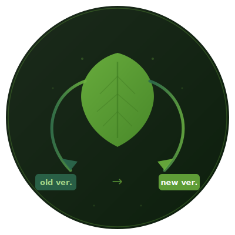
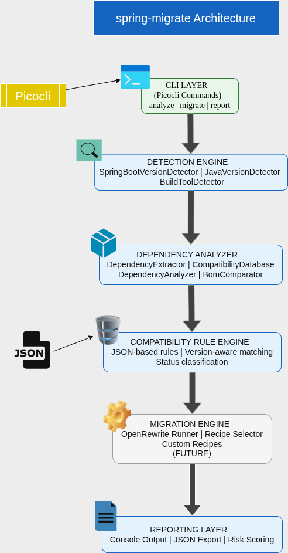

<div align="center">



<br/>

# spring-migrate

**Spring Boot Migration Assistant**

Analyze your Spring Boot project before migration — know exactly what will break, what needs updating, and what's safe.

[](https://github.com/Ayoubbooob/spring-migrate/actions/workflows/build.yml)
[](LICENSE)
[](https://openjdk.org/projects/jdk/17/)
[](CONTRIBUTING.md)

[Getting Started](#quick-start) · [Usage](#usage) · [Architecture](#architecture) · [Roadmap](ROADMAP.md) · [Contributing](CONTRIBUTING.md)

</div>

---

## Why

Migrating Spring Boot (e.g., 2.x → 3.x) involves far more than a version bump:

- Java baseline changes (11 → 17)
- `javax.*` → `jakarta.*` namespace migration
- Dependencies that are removed, renamed, or incompatible
- Configuration properties that were renamed or dropped
- APIs that compiled before but now fail

For a project with 50+ dependencies, manually checking each one takes hours. spring-migrate does it in seconds.

---

## Quick Start

### Prerequisites

- Java 17+
- Maven

### Build

```bash
git clone https://github.com/Ayoubbooob/spring-migrate.git
cd spring-migrate
mvn clean package -DskipTests
```

### Install

```bash
chmod +x install.sh
./install.sh
```

This creates a symlink in `/usr/local/bin` so you can run `spring-migrate` from any directory.

### Run

```bash
cd your-spring-boot-project
spring-migrate analyze --to 3.2.2
```

---

## Usage

### `analyze` — Analyze a project for migration readiness

```bash
spring-migrate analyze --to <target-version>
```

| Option | Description                             | Required |
| ------ | --------------------------------------- | -------- |
| `--to` | Target Spring Boot version (e.g. 3.2.2) | Yes      |

The command will:

1. Detect the current Spring Boot version (from parent, BOM, properties)
2. Check all dependencies against the compatibility database
3. Print a structured report with findings and recommendations

### Exit Codes

| Code | Meaning                                       |
| ---- | --------------------------------------------- |
| `0`  | No issues found — migration looks clean       |
| `1`  | Error (e.g., no Spring Boot version detected) |
| `2`  | Version conflicts or compatibility issues     |

Exit codes are designed for CI/CD pipelines.

---

## Example Output

```
  ┌───────────────────────────────────────┐
  │      🍃 SPRING-MIGRATE                │
  │   Spring Boot Migration Assistant     │
  └───────────────────────────────────────┘

━━━ Version Detection ━━━━━━━━━━━━━━━━━━━━━━
  Current Version: 2.7.8
  Target Version:  3.2.2
  Source:          PARENT
  Confidence:      HIGH

  ✓ CONSISTENT CONFIGURATION

━━━ Dependency Analysis ━━━━━━━━━━━━━━━━━━━━
  Total scanned:   23

  ⚠ Found 3 compatibility issues:

    ┌─ javax.servlet:javax.servlet-api
    │  Status: REPLACED
    │  Action: Replace with jakarta.servlet:jakarta.servlet-api:6.0.0
    └─

    ┌─ io.springfox:springfox-swagger2
    │  Status: REMOVED
    │  Action: Replace with org.springdoc:springdoc-openapi-starter-webmvc-ui:2.3.0
    └─

    ┌─ org.projectlombok:lombok
    │  Status: NEEDS_UPDATE
    │  Action: Update to minimum version 1.18.30
    └─
```

---

## Architecture

<div align="center">



</div>

Each layer has a single responsibility. Engines can be improved or replaced independently.

### Key design choices

- **Plain Java** — No Spring Boot in the tool itself. Faster startup, smaller JAR, no version conflicts with analyzed projects.
- **Picocli** — Instant startup, subcommand support, professional CLI output with zero config.
- **Jackson** — Standard JSON parsing for the compatibility rule database.
- **JSON rule engine** — No recompilation to add rules. Easy to contribute, version, and extend.

---

## Compatibility Database

Migration rules are stored in `src/main/resources/compatibility/migrations.json`.

Example rule:

```json
{
  "javax.servlet-api": {
    "status": "REPLACED",
    "replacement": {
      "groupId": "jakarta.servlet",
      "artifactId": "jakarta.servlet-api",
      "version": "6.0.0"
    },
    "notes": "javax.* namespace moved to jakarta.* in Spring Boot 3"
  }
}
```

### Dependency statuses

| Status         | Meaning                                          |
| -------------- | ------------------------------------------------ |
| `COMPATIBLE`   | Works with the target version as-is              |
| `NEEDS_UPDATE` | Works, but requires a minimum version            |
| `REPLACED`     | Replaced by a different artifact                 |
| `REMOVED`      | No longer included in Spring Boot                |
| `INCOMPATIBLE` | Known to be incompatible with the target version |
| `UNKNOWN`      | Not in the database — requires manual review     |

---

## Why Not Just Use OpenRewrite?

OpenRewrite is excellent at code transformation — renaming packages, updating APIs, modifying config files. spring-migrate does not replace it. It complements it.

**OpenRewrite** answers: _"Apply these transformations to my code."_

**spring-migrate** answers: _"What will break? What's the risk? What should I fix first?"_

| Capability                                | OpenRewrite | spring-migrate |
| ----------------------------------------- | :---------: | :------------: |
| Detect Spring Boot version (multi-source) |             |       ✓        |
| Analyze dependency compatibility          |             |       ✓        |
| Warn about removed/incompatible libraries |             |       ✓        |
| Risk assessment before migration          |             |  ✓ (planned)   |
| `javax` → `jakarta` code transformation   |      ✓      |    planned     |
| Deprecated API replacement                |      ✓      |    planned     |
| Config property migration                 |      ✓      |    planned     |

The plan is to integrate OpenRewrite as the transformation backend inside spring-migrate. The tool provides the diagnosis; OpenRewrite provides the scalpel.

---

## Roadmap

### Phase 1 — Detection Engine

- [x] Spring Boot version detection (parent, BOM, properties)
- [x] Property placeholder resolution
- [x] Confidence scoring
- [x] Version conflict detection
- [ ] Java version detection and validation (Java 17+)
- [ ] Build tool detection (Maven vs Gradle)

### Phase 2 — Dependency Analysis

- [x] Dependency extraction from `pom.xml`
- [x] Compatibility classification against JSON rules
- [x] Replacement suggestions
- [ ] Risk scoring system
- [ ] Transitive dependency analysis

### Phase 3 — CLI & Reporting

- [x] `analyze` command with `--to` flag
- [x] Structured terminal output
- [x] CI-friendly exit codes
- [ ] JSON report export (`--format json`)
- [ ] Summary and verbose modes

### Phase 4 — Automated Migration

- [ ] OpenRewrite integration
- [ ] `migrate` command with dry-run mode
- [ ] `javax` → `jakarta` namespace migration
- [ ] Config property migration
- [ ] Backup and rollback support

### Phase 5 — Ecosystem

- [ ] Gradle support
- [ ] Multi-module project support
- [ ] GraalVM native image
- [ ] Community rule contributions

See [ROADMAP.md](ROADMAP.md) for the full breakdown.

---

## Contributing

Contributions are welcome — whether it's adding compatibility rules, reporting edge cases, or improving the engine.

👉 See [CONTRIBUTING.md](CONTRIBUTING.md) for the full guide (setup, PR process, branch naming, commit conventions).

The easiest way to start:

1. **Add compatibility rules** — If you've hit a dependency issue during a Spring Boot migration, add a rule to `src/main/resources/compatibility/migrations.json`.
2. **Report edge cases** — Unusual POM structures, detection failures, or incorrect classifications.
3. **Submit test projects** — Real-world `pom.xml` files that expose edge cases (see `test-projects/`).

Please read our [Code of Conduct](CODE_OF_CONDUCT.md) before participating.

For security vulnerabilities, see [SECURITY.md](SECURITY.md).

---

## Changelog

See [CHANGELOG.md](CHANGELOG.md) for a detailed list of changes per version.

---

## License

[MIT](LICENSE)
